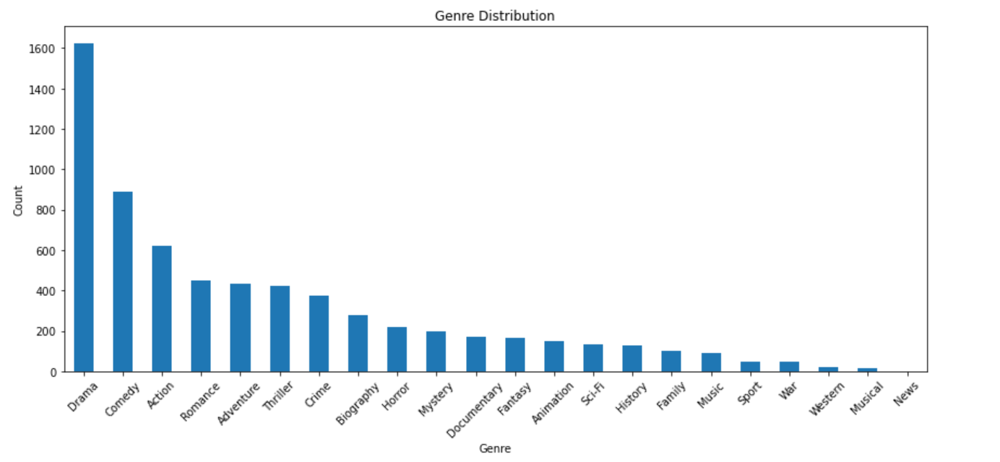
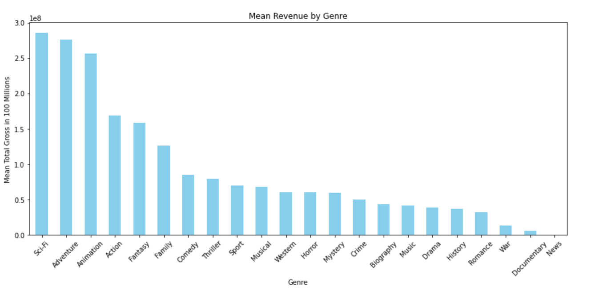

# Project 2 - Film Analysis
## Overview 
This repository houses an in-depth analysis of films and what characterstics successful films have. The analysis is aimed toward aiding the companies fledgling original video content department. 
## Business Understanding
The primary audience for this analysis is for decision makers involved with the newly created movie studio. Financially successful films were defined as films that made 2x or more total gross than their production budget.  
## Data Understanding and Analysis
The data utilized came primarily from 3 websites listed below. In order to draw conclusions from the data comparisions were plotted using bar charts, box plots, line graphs, and scatterplots. Several statistical measurements were used including mean, median, and percentages. Two methods for dealing with missing data were utilized. There were 7 missing values for genres, as this was such a small amount those rows were dropped. For missing data contained in domestic/foreign gross missing data was set to zero and both columns were aggregated as missing values were likely a result of either a completely foreign or domestic release. 
### Websites and a description of data:
* [Box Office Mojo](https://www.boxofficemojo.com/)
    * Contains columns titled: title, studio, domestic_gross, foreign_gross and year
    * 3387 rows of movie data entries
* [IMDB](https://www.imdb.com/)
    * Contains muitiple tables
    * Columns in analysis: genres, primary_title, runtime_minutes, original_title, averagerating, numvotes
    * Has 28753 rows of movie information but multiple duplicates as language variation has an entry
* [The Numbers](https://www.the-numbers.com/)
    * Contains data regarding production and box office numbers
    * Columns: id, release_date, movie, production_budget, domestic_gross, wordlwide_gross 
    * Has financial information about 5782 movies

### Visualizations used in analysis
Scatterplot of financially successful films

Line graph of when films with the highest average gross are released

Box Chart to look at distribution and outliers of revenue by genre type

Bar chart showing total distribution of films by genre type

Bar chart showing mean revenue by genre type

Bar chart of median revenue by genre type for resilience to outliers

## Conclusion
### Key insights for new movie studio production
* Production Budget: Budgets of 1 million or more performed .52% better than films with a budget of 500,000 or more and almost 11% better than all films with a lower budget. A budget of 1 million is advisable as every increase of 500,000 results in diminishing returns. 
* Genres: Invest in adventure sci-fi, and animation films. All 3 were by far the highest performing 3 genre categories making on average 1 million more than the next. Only 2 films in the top 50 highest grossing films were genres others than action and/or adventure. 
* Release Date: Recommend releasing films in either the summer or winter as those are the months with the highest mean revenues, especially May. All but one of the top 15 highest grossing films was released near a US holiday or when school is out. 

### Navigating the Repository
* README.md
* project-2-film-analysis.ipynb
* .gitignore
* film-analysis-presentation.pdf
* zippedData
    * bom.movie_gross.csv.gz
    * im.db
    * im.db.zip
    * rt.movie_info.tsv.gz
    * rt.reviews.tsv.gz
    * tmdb.movies.csv.gz
    * tn.movie_budgets.csv.gz
* images-graphs
    * film_blog_5.webp
    * genres-box-chart.png
    * genres-count-bar.png
    * genres-mean-revenue-bar.png
    * genres-median-total-bar.png
    * production-budget.png
    * release-date-timeline.png

### Link to Presentation

### Link to Blog
https://datasciencedigested.blogspot.com/2024/08/wasted-time-and-effort.html